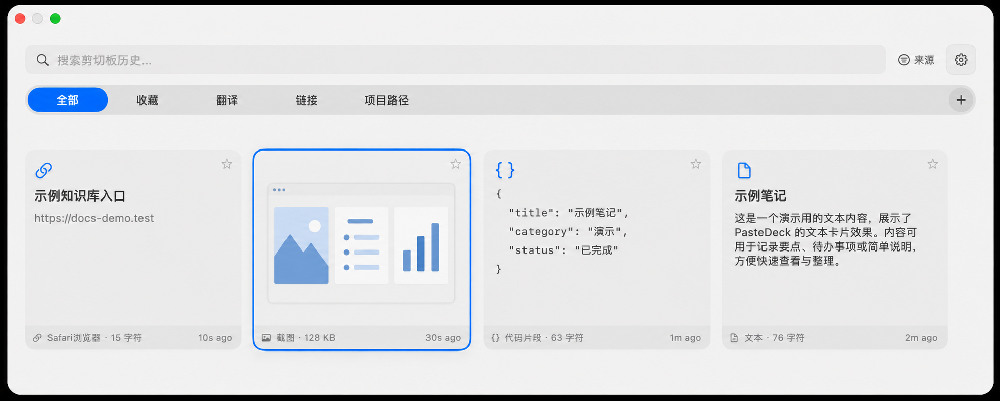

# PasteDeck

PasteDeck is a native macOS clipboard manager for quickly searching, previewing, organizing, and pasting clipboard history from a floating panel.



## Highlights

- Records clipboard history for text, rich text, links, Markdown, JSON, images, files, and colors.
- Shows website names for link cards and lets link history be searched by site name. Automatically fetches webpage titles for copied links.
- Opens from the menu bar or the global shortcut `Command + Shift + V`.
- Menu bar dropdown includes a stats overview header showing today's copies, total items, and cache size.
- Provides fast keyboard navigation that keeps the selected card fully visible at every panel size, plus favorite filters, custom collections, pinning, deletion, and batch paste.
- Supports horizontal and vertical panel layouts with vertical styles: compact list, large cards, and adaptive grid.
- Preserves RTF data for rich text paste and supports plain-text paste with `Shift + Enter`.
- Renders Markdown, JSON, code snippets, images, image files, file metadata, links, and colors in the preview window.
- Runs OCR for copied images so recognized text can be searched later.
- Supports editable previews for text, code, and colors.
- Includes a dedicated translation center with opt-in automatic selected-text translation windows, `Option + D` selected-text translation, `Option + S` screenshot OCR translation, and `Option + A` input translation; shortcuts are customizable.
- Text previews open the unified translation workspace from the Translate button or `T`. `Escape` and `Command + W` both close it and return focus to the clipboard panel.
- Supports multiple saved keys for Baidu, Tencent Cloud, Youdao, and Alibaba Cloud. Credentials are stored in the local macOS Keychain; SwiftData stores only configuration metadata and credential references. One key per provider can be enabled at a time, while enabled providers translate in parallel into comparable, independently scrollable result cards. OpenAI-compatible LLM calls add a new result card instead of replacing an existing translation; connection tests report availability and latency.
- The translation workspace keeps translation actions inside the source card and exposes configured LLMs as direct comparison choices. Translation service settings use grouped credential cards with clear status and add-service entry points.
- Translation settings, model choices, and result cards show locally bundled provider logos for Baidu, Tencent Cloud, Youdao, Alibaba Cloud, DeepSeek, GLM, Kimi, MiMo, OpenAI, MiniMax, and Qwen. Logo files are cached in memory and never fetched at runtime.
- `Option + D` fallback probes are globally serialized and restore the original multi-format clipboard. Automatic translation may use this bounded fallback only after a real mouse selection; keyboard-created selections never trigger automatic translation.
- Automatic selected-text translation requires both Accessibility and Input Monitoring. The settings page reports Input Monitoring status and opens the matching System Settings page; with permission, a recoverable event tap reliably observes mouse selections in other apps.
- Closing an automatic translation window does not reopen it while the original text remains selected. A new mouse selection opens translation again, even when it contains the same text.
- Statistics panel with daily/30-day trends, type distribution, source app insights, extreme records, and daily translation usage by provider, key fingerprint, and LLM model/token count.
- Theme support: light, dark, or follow system appearance.
- Stores history locally with SwiftData and caches images under `~/Library/Caches/PasteDeck/images/`.

## Installation

### Download

1. Download the latest `PasteDeck-*.dmg` from [Releases](https://github.com/wq247934/paste-deck/releases).
2. Open the DMG.
3. Drag `PasteDeck.app` into Applications.
4. Launch PasteDeck from Applications.

### Build From Source

```bash
git clone https://github.com/wq247934/paste-deck.git
cd paste-deck
open Package.swift
```

Build and run from Xcode with the local Mac destination. For a terminal-only compile check:

```bash
swift build
```

## Permissions

PasteDeck requests Accessibility permission for reading selected text and simulating `Command + C` / `Command + V`. Carbon global shortcut registration itself does not require Accessibility permission.

Screenshot OCR translation also requires Screen Recording permission when macOS prompts for it.

Clipboard polling uses `NSPasteboard`; it does not require Accessibility by itself. Enable the permission in System Settings -> Privacy & Security -> Accessibility.

## Usage

1. Copy text, images, files, links, colors, Markdown, JSON, or rich text.
2. Press `Command + Shift + V` or choose PasteDeck from the menu bar.
3. Search, filter, preview, favorite, pin, delete, or paste an item.
4. Press `Space` to preview the selected item.
5. Press `Enter` to paste, or `Shift + Enter` to paste plain text.

## Keyboard Shortcuts

| Shortcut | Action |
| --- | --- |
| `Command + Shift + V` | Toggle PasteDeck |
| `Option + D` | Translate selected text (customizable) |
| `Option + S` | Capture a screen region, OCR, and translate (customizable) |
| `Option + A` | Open the input translation window (customizable) |
| `Command + F` | Focus search |
| `Left` / `Right` | Move between cards |
| `Shift + Left` / `Shift + Right` | Extend multi-selection |
| `Up` / `Down` | Page through cards |
| `Tab` | Switch filter tab |
| `Enter` | Paste selected item |
| `Shift + Enter` | Paste selected item as plain text |
| `Space` | Preview selected item |
| `Delete` | Delete selected item |
| `Esc` | Close preview or panel |

## Supported Content

| Type | Detection | Preview / Paste Behavior |
| --- | --- | --- |
| Text | Plain pasteboard string | Full text preview, editable preview, rich text paste when RTF exists |
| Link | URL detection | Link preview and URL pasteboard data |
| Markdown | Pasteboard Markdown type or Markdown-like text | Rendered Markdown preview and original text paste |
| JSON | Valid JSON object or array text | JSON/code-style preview and original text paste |
| Image | TIFF/PNG pasteboard data | Cached image preview, actual-size preview, OCR search |
| File | File URL | File metadata, image-file preview where supported |
| Color | `NSColor` pasteboard data | Color swatch and hex value |

## Architecture

### Entry Point
- `PasteDeckApp.swift` starts the SwiftUI app and seeds the protected `收藏` and `翻译` system collections.
- `AppDelegate` owns the status bar item, app lifecycle, settings window, hotkey registration, and lazy main panel creation.
- `StatusMenuBuilder` builds the custom status bar dropdown menu with an embedded stats overview header.

### Data Layer (SwiftData)
- `ClipboardItem` — clipboard history entries and recoverable translation workspace snapshots.
- `ClipboardContentType` — enum: text, link, markdown, json, image, file, color.
- `AppSettings` — user preferences including panel orientation (horizontal/vertical), vertical panel style (compact list, large cards, adaptive grid), theme mode, multiple translation API keys, and LLM settings.
- `FavoriteCollection` — favorite collection storage, including protected `收藏` and `翻译` system groupings.
- `DailyStatsSnapshot` — per-day aggregated statistics snapshot for the stats panel, avoiding full-table scans.
- `TranslationUsageSnapshot` — per-day translation usage aggregate keyed by provider/key/model, including request counts and returned LLM tokens.

### Services
- `ClipboardMonitor` polls `NSPasteboard`, parses content, deduplicates entries, saves history, schedules OCR, and runs cleanup.
- `ClipboardHistoryStore` loads and filters history for the main panel, manages selection, favorites, collections, deletion, and batch paste.
- `HotKeyManager` uses Carbon `RegisterEventHotKey` for independent clipboard and translation shortcuts.
- `PasteService` writes selected content back to the pasteboard and simulates paste through `CGEvent`.
- `CacheManager` manages image cache at `~/Library/Caches/PasteDeck/images/` with configurable size limits.
- `ImageOCRService` runs Vision OCR for copied images and persists searchable text.
- `LinkTitleService` fetches webpage titles for copied links asynchronously without blocking UI.
- `TranslateService` provides Baidu, Tencent Cloud, Youdao, and Alibaba Cloud translation adapters plus OpenAI-compatible LLM translation, model-list retrieval, and request timeouts.
- `TranslationWorkspaceCache` persists translation workspaces in the protected translation collection so they can be reopened with their original source and results.
- `TranslationCoordinator` manages selected-text monitoring, nonactivating tooltips, screenshot OCR, translation shortcuts, and translation windows with retry and cancellation controls.
- `TranslationUsageTracker` serializes daily API and LLM usage aggregates without blocking translation responses.
- `TranslationCredentialStore` stores all API credential pairs and LLM API keys in one protected macOS Keychain envelope, caches it per process, and batch-migrates older per-key entries; settings JSON retains only opaque references.
- `StatsService` computes aggregated statistics (overview, trends, type distribution, insights) on background threads.
- `DailyStatsUpdater` handles incremental upsert and one-time backfill of `DailyStatsSnapshot`.
- `PreviewConfig` manages preview sizing and mode preferences.

### UI Layer
- `MainPanelController` — `NSPanel` controller for the floating window (centered, popUpMenu level, vibrancy effect).
- `MainPanelView` — main SwiftUI view with search, favorite filters, virtualized horizontal/vertical cards, and keyboard handling.
- `KeyboardFocusPanel` — dedicated keyboard focus management component.
- `SearchBarView` — search field component.
- `ClipCardView` — individual clipboard item card.
- `PreviewWindow` — large preview for text, Markdown, JSON/code, image, file, color, and translation.
- `CodeHighlightView` — editable code preview with syntax highlighting.
- `MarkdownRenderedText` — Markdown rendering support.
- `SettingsWindow` — 9 settings tabs: General, Hotkey, History, Stats, Filter, Favorites, Appearance, Translation, Advanced.
- `StatsSettingsView` / `StatsViewModel` — statistics panel with trend charts, type distribution, and usage insights.

### Utilities
- `AppearanceManager` centralizes theme → `NSAppearance` resolution for the main panel, preview window, and settings window.
- `ImageFilePreview` handles image file preview rendering.

## Testing

Unit tests cover panel layout geometry, card sizing, and settings layout:

```bash
swift test
```

## Release Packaging

The DMG script is guarded so routine development does not accidentally mount or open installer windows.

```bash
PASTEDECK_ALLOW_DMG_BUILD=1 bash scripts/build-dmg.sh
```

The output is copied to the repository root as `PasteDeck-<version>.dmg`.

## Requirements

- macOS 14.0 Sonoma or later
- Swift 5.9 package manifest
- Xcode for interactive app builds

## License

PasteDeck is released under the MIT License. See [LICENSE](LICENSE).

---

# PasteDeck 中文说明

PasteDeck 是一个原生 macOS 剪贴板管理器，用浮动面板快速搜索、预览、整理和粘贴剪贴板历史。

## 功能亮点

- 记录文本、富文本、链接、Markdown、JSON、图片、文件和颜色。
- 链接卡片会显示网站名称，并支持按网站名搜索链接历史。自动抓取复制链接的网页标题。
- 支持菜单栏打开，也支持全局快捷键 `Command + Shift + V`。
- 菜单栏下拉菜单内嵌统计概览，展示今日复制次数、总条数和缓存占用。
- 支持键盘导航，并会按当前面板可视区域自动滚动选中卡片；同时支持收藏筛选、自定义收藏夹、系统“翻译”分类、置顶、删除和批量粘贴。翻译分类固定在“收藏”之后，不能删除、改名或排序。
- 支持横向和竖向面板布局，竖向提供紧凑列表、大卡片和自适应网格三种样式。
- 保留 RTF 富文本数据，并支持 `Shift + Enter` 纯文本粘贴。
- 预览窗口支持 Markdown、JSON、代码片段、图片、图片文件、文件信息、链接和颜色。
- 图片复制后会进行 OCR，识别出的文字可以参与搜索。
- 文本、代码和颜色可以在预览窗口中编辑。
- 新增独立翻译中心：划词后自动打开翻译窗口（默认关闭）；`Option + D` 翻译所选文本、`Option + S` 截图 OCR 翻译、`Option + A` 输入翻译默认开启，三组快捷键均可自定义。
- 普通文本预览可点击“翻译”或按 `T` 进入统一翻译工作区；工作区支持按 `Esc` 或 `Command + W` 关闭，并把焦点还给剪贴板主面板。
- 常规翻译支持百度、腾讯云、网易有道、阿里云：同一服务可保存多套密钥，每类服务只启用一套密钥；完整凭据存于单一受保护的 macOS Keychain 凭据包，SwiftData 仅保存配置元数据和凭据引用。不同已启用服务并行输出可滚动对比卡片。
- 大模型支持 DeepSeek、GLM、Kimi、MiMo、OpenAI、MiniMax、通义千问及自定义 OpenAI-compatible 端点。模型名称可通过服务商 `/models` 接口获取后选择，也可手动输入；不会预填模型名称。重复选择同一模型会保留之前的译文卡片用于比对。
- 大模型原文预计超过 8,000 token 时会提示成本与上下文风险并要求确认；所有翻译请求有 60 秒超时，并可在卡片上取消或重试。每次翻译会缓存原文和译文到“翻译”分类，按 `Space` 可恢复当时的翻译工作区。
- 翻译工作区采用原文卡片内操作和大模型快捷卡片，不再保留底部“翻译所有已启用 API”按钮与大模型下拉框；翻译服务配置使用分组凭据卡片和服务选择入口。
- 翻译配置、模型选择和译文卡片会显示百度、腾讯云、有道、阿里云、DeepSeek、GLM、Kimi、MiMo、OpenAI、MiniMax、通义千问的本地品牌 Logo；运行时不联网获取图片，并使用进程内缓存避免滚动时重复解码。
- `Option + D` 的跨应用复制兜底全局串行执行并恢复原多格式剪贴板。自动划词仅在一次真实鼠标划词后才可能使用这条受限兜底；键盘创建的选区不会自动触发翻译。
- 自动划词需要“辅助功能”和“输入监控”权限。设置页会显示输入监控状态并可直达系统设置；获得权限后通过可恢复的事件 tap 可靠识别其他应用的鼠标划词。
- 关闭自动翻译窗口后，原文本仍处于选中状态也不会再次弹窗；重新鼠标划选时，即使文本相同也会重新触发。
- 统计面板：展示每日/近 30 天趋势、类型分布、来源 App 洞察、极值记录，以及按日期、服务类型、密钥指纹和模型汇总的翻译调用与 token 用量。
- 主题支持：亮色、暗色或跟随系统外观。
- 历史记录使用 SwiftData 本地存储，图片缓存位于 `~/Library/Caches/PasteDeck/images/`。

## 安装

1. 从 [Releases](https://github.com/wq247934/paste-deck/releases) 下载最新的 `PasteDeck-*.dmg`。
2. 打开 DMG。
3. 将 `PasteDeck.app` 拖入“应用程序”。
4. 从“应用程序”启动 PasteDeck。

## 从源码运行

```bash
git clone https://github.com/wq247934/paste-deck.git
cd paste-deck
open Package.swift
```

在 Xcode 中选择本机 Mac 运行。只做命令行编译校验时可以运行：

```bash
swift build
```

## 权限

PasteDeck 需要辅助功能权限来读取前台应用选中文字，并模拟 `Command + C` / `Command + V`。Carbon 全局快捷键注册本身不依赖辅助功能权限。剪贴板轮询使用 `NSPasteboard`，本身不依赖辅助功能权限。首次使用截图 OCR 翻译时，macOS 还可能请求“屏幕录制”权限。

授权路径：系统设置 -> 隐私与安全性 -> 辅助功能。

## 常用操作

1. 复制文本、图片、文件、链接、颜色、Markdown、JSON 或富文本。
2. 按 `Command + Shift + V`，或从菜单栏打开 PasteDeck。
3. 搜索、筛选、预览、收藏、置顶、删除或粘贴项目。
4. 按 `Space` 预览当前项目。
5. 按 `Enter` 粘贴，按 `Shift + Enter` 以纯文本粘贴。

## 快捷键

| 快捷键 | 操作 |
| --- | --- |
| `Command + Shift + V` | 打开或关闭 PasteDeck |
| `Option + D` | 翻译当前选中文字（可自定义） |
| `Option + S` | 区域截图、OCR 并翻译（可自定义） |
| `Option + A` | 打开输入翻译窗口（可自定义） |
| `Command + F` | 聚焦搜索框 |
| `Left` / `Right` | 在卡片间移动 |
| `Shift + Left` / `Shift + Right` | 扩展多选 |
| `Up` / `Down` | 翻页浏览卡片 |
| `Tab` | 切换筛选标签 |
| `Enter` | 粘贴选中项目 |
| `Shift + Enter` | 以纯文本粘贴 |
| `Space` | 预览选中项目 |
| `Delete` | 删除选中项目 |
| `Esc` | 关闭预览或面板 |

## 测试

单元测试覆盖面板布局几何、卡片尺寸和设置布局：

```bash
swift test
```

## 发布打包

日常开发不会自动打 DMG。只有明确发布时才运行：

```bash
PASTEDECK_ALLOW_DMG_BUILD=1 bash scripts/build-dmg.sh
```

生成的安装包会复制到仓库根目录，命名为 `PasteDeck-<version>.dmg`。
